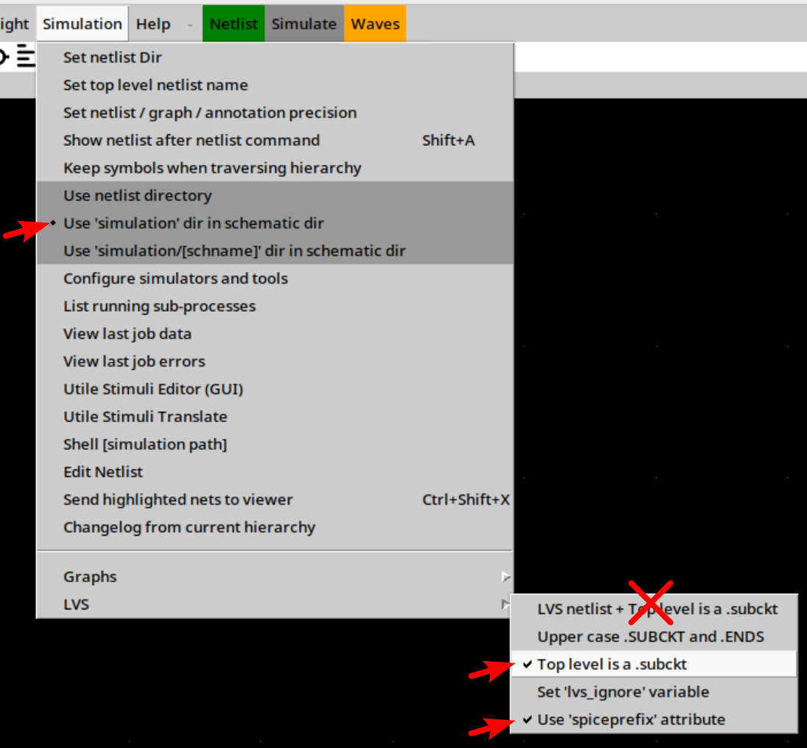
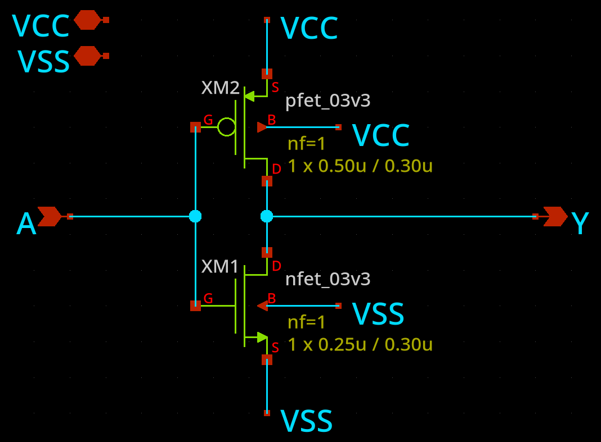
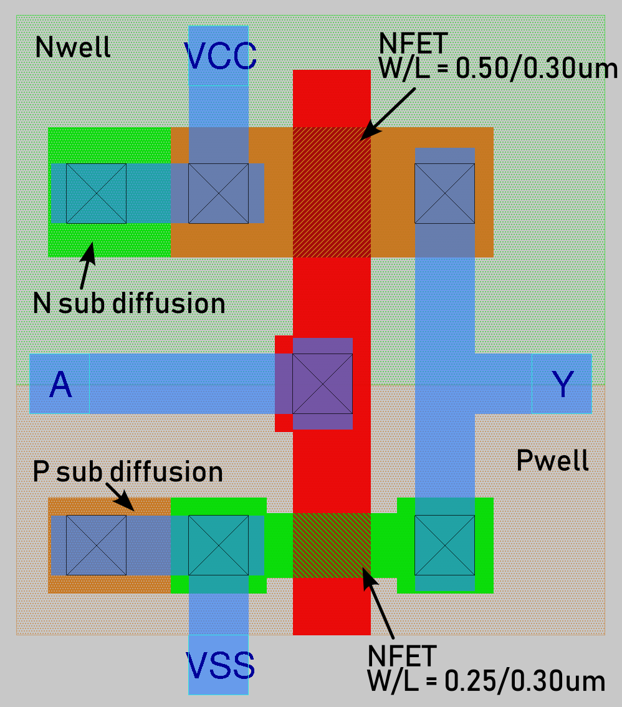

# Minimal gf180mcuD open source PDK LVS test using Magic/Netgen 

## Overview

This demonstrates an example of a working minimal LVS solution using:
* A CMOS inverter implemented in the gf180mcuD open PDK
* Schematic created using Xschem and exported to a SPICE netlist
* gf180mcu layout created using Magic (i.e. a `.mag` file, but optionally also exported as a GDS file)
* Simple script that does layout extraction to an LVS-suitable SPICE netlist using Magic
* Simple script that does LVS comparison and report using Netgen's `lvs` command with the PDK-provided `gf180mcuD_setup.tcl` file

Also included in the repo are all log files emitted by the extraction/LVS process, and the final passing LVS report showing "Netlists match uniquely".

## Files in this repo

In this repo, you will find:

*   [./magic/inverter.mag](./magic/inverter.mag): Layout of a simple CMOS inverter (with well taps, and PFET bigger than NFET as you'd expect). This layout is also exported to GDS: [./magic/inverter.gds](./magic/inverter.gds).
    *   [./magic/inverter.lvs.spice](./magic/inverter.lvs.spice): Corresponding extracted netlist for LVS.
*   [./xschem/inverter.sch](./xschem/inverter.sch): Xschem schematic for the same inverter.
    *   [./xschem/simulation/inverter.spice](./xschem/simulation/inverter.spice): Corresponding exported netlist for LVS.
*   [./magic/do_lvs.sh](./magic/do_lvs.sh): Script for doing extraction (using Magic) and LVS (using Netgen).
    *   Magic executes [./magic/extract_for_lvs.tcl](./magic/extract_for_lvs.tcl) to do the layout extraction.
    *   Netgen executes [./magic/lvs_netgen.tcl](./magic/lvs_netgen.tcl) to do the LVS comparison.
*   [./magic/do_lvs.log](./magic/do_lvs.log): Console output from running `do_lvs.sh`.
*   [./magic/lvs.report](./magic/lvs.report): Netgen LVS report showing `DEVICE mismatches` and `Netlists do not match`.

## My environment where this was proven

### Versions:

```
$ magic --version
8.3.650

$ netgen -noconsole eval 'exit'
Netgen 1.5.320 compiled on Wed May 27 11:20:32 ACST 2026

$ xschem --version
XSCHEM V3.4.8RC

$ ciel ls
In /home/anton/ttsetup@ttgf26a/pdk/ciel/gf180mcu/versions:
├── 61a056e180dac7dcc6d4eb7529e2231f95105746 (2026.05.25) (enabled)
└── 54435919abffb937387ec956209f9cf5fd2dfbee (2025.12.26)
```

For reference, `ciel` was installed via `pip install` using the [Tiny Tapeout Local Hardening guide](https://tinytapeout.com/guides/local-hardening/), and subsequently used to `ciel enable 61a056e180dac7dcc6d4eb7529e2231f95105746` that version of the gf180mcuD PDK and install it. There are other ways to do this, of course.

### Environment variables:

```bash
export PDK_ROOT=/home/anton/ttsetup@ttgf26a/pdk
export PDK=gf180mcuD

ls -al $PDK_ROOT/$PDK
# /home/anton/ttsetup@ttgf26a/pdk/gf180mcuD -> ciel/gf180mcu/versions/61a056e180dac7dcc6d4eb7529e2231f95105746/gf180mcuD

ls -al $PDK_ROOT/$PDK/libs.tech/magic/PDK.magicrc  # aka $PDK_MAGICRC
# -rw-rw-r-- 1 anton anton 1997 May 27 13:52 /home/anton/ttsetup@ttgf26a/pdk/gf180mcuD/libs.tech/magic/gf180mcuD.magicrc
```

## How to export the LVS SPICE netlist correctly from Xschem



In Xschem, I had been using different export options for other PDKs, which might not be correct, and so the options above are the ones I have now used that seem to be correct. These are found in the "Simulation" menu:
*   `Use 'simulation' dir in schematic dir`
*   `LVS` => `Top level is a .subckt` -- Generate a SPICE file compatible with how Magic does the layout extraction.
*   `LVS` => `Use 'spiceprefix' attribute` -- Use the `X` prefix for device instances as specified in the properties of each transistor by defalut.
*   Do **NOT** use the `LVS netlist + Top level is a .subckt` option -- This one in particular I was using from prior experience, but it ignores the `spiceprefix` attribute and generates `M` devices which confuse Netgen. Netgen sees these as true SPICE MOSFETS rather than abstract subcircuit representations of extracted transistors, and that leads to the emergence of implied `source`, `drain`, `gate`, and `bulk` ports as well as other weird `proxy` stuff.

## The inverter schematic



Clicking the "Netlist" toolbar button generates `xschem/simulation/inverter.spice`, which looks like this (or near enough):

```spice
** sch_path: /home/anton/projects/ttgf26a-analog/xschem/inverter.sch
.subckt inverter VCC VSS A Y
*.PININFO VCC:B VSS:B A:I Y:O
XM1 Y A VSS VSS nfet_03v3 L=0.30u W=0.25u nf=1
+   ad='int((nf+1)/2) * W/nf * 0.18u'
+   as='int((nf+2)/2) * W/nf * 0.18u'
+   pd='2*int((nf+1)/2) * (W/nf + 0.18u)'
+   ps='2*int((nf+2)/2) * (W/nf + 0.18u)'
+   nrd='0.18u / W'
+   nrs='0.18u / W'
+   sa=0 sb=0 sd=0
XM2 Y A VCC VCC pfet_03v3 L=0.30u W=0.50u nf=1
+   ad='int((nf+1)/2) * W/nf * 0.18u'
+   as='int((nf+2)/2) * W/nf * 0.18u'
+   pd='2*int((nf+1)/2) * (W/nf + 0.18u)'
+   ps='2*int((nf+2)/2) * (W/nf + 0.18u)'
+   nrd='0.18u / W'
+   nrs='0.18u / W'
+   sa=0 sb=0 sd=0
.ends
```

## The inverter layout in Magic



## Performing extraction and LVS

In the `magic/` dir, running `./do_lvs.sh` will:
1.  Use `magic` (with the PDK-provided `gf180mcuD.magicrc` file) to run `extract_for_lvs.tcl`:
    ```tcl
    set cellname [lindex $argv $argc-1]     ;# Set 'cellname' variable to script's 1st argument.
    box 0 0 0 0                             ;# Select a dummy box at (0,0) with no size.
    load $cellname.mag                      ;# Load the .mag file at the location of the dummy box.
    extract do local                        ;# Configure extraction to write to the local/current dir.
    extract all                             ;# Perform extraction (producting .ext files).
    ext2spice lvs                           ;# Configure ext2spice for doing LVS-specific conversion from .ext to .spice.
    ext2spice cthresh infinite              ;# Prevent writing of parasitics capacitors (keep intentional capacitors only).
    ext2spice short resistor                ;# Directly-connected nets should be preserved and shorted using 0R resistors.
    ext2spice -d -o $cellname.lvs.spice     ;# Produce .spice file from .ext file now.
    quit -noprompt
    ```
2.  Besides producing `.ext` files (full extraction data which is later discarded), this also then generates the layout-extracted SPICE netlist `magic/inverter.lvs.spice` which is _equivalent to_ the following:
    ```spice
    * NGSPICE file created from inverter.ext - technology: gf180mcuD

    .subckt inverter VCC VSS A Y
    X0 Y A VSS VSS nfet_03v3 L=0.30u W=0.25u
    +   ad=0.1619p pd=1.68u as=0.1619p ps=1.68u
    **devattr s=13432,524 d=6476,336

    X1 Y A VCC VCC pfet_03v3 L=0.30u W=0.5u
    +   ad=0.235p pd=1.94u as=0.235p ps=1.94u
    **devattr s=18800,576 d=9400,388
    .ends
    ```
3.  `netgen` is then used: It is instructed to evaluate commands that set the `cellname` variable (i.e. `"inverter"`) and `report_file` variable (i.e. `"lvs.report"`), and then load and execute the `lvs_netgen.tcl` script:
    ```tcl
    # This script expects $cellname and $report_file to be set by the caller.

    set layout [readnet spice $cellname.lvs.spice]  ;# "L": Overall SPICE netlist extracted from layout.
    set schem  [readnet spice /dev/null]            ;# "S": Placeholder for schematic netlist; we'll add to it as needed, depending on what we're LVSing.

    # Load SPICE netlist:
    readnet spice ../xschem/simulation/$cellname.spice $schem
        
    lvs "$layout $cellname" "$schem $cellname" \
        $::env(PDK_ROOT)/$::env(PDK)/libs.tech/netgen/$::env(PDK)_setup.tcl \
        $report_file \
        -blackbox
    ```
    Note that this script references the netgen "setup script" (i.e. `gf180mcuD_setup.tcl`) via this argument to the `lvs` command:
    ```
    $::env(PDK_ROOT)/$::env(PDK)/libs.tech/netgen/$::env(PDK)_setup.tcl
    ```
4.  When this script runs, besides printing out a bunch of progress/status information (captured in [`magic/do_lvs.log`](./magic/do_lvs.log)), the [`magic/lvs.report`](./magic/lvs.report) file is also generated.
